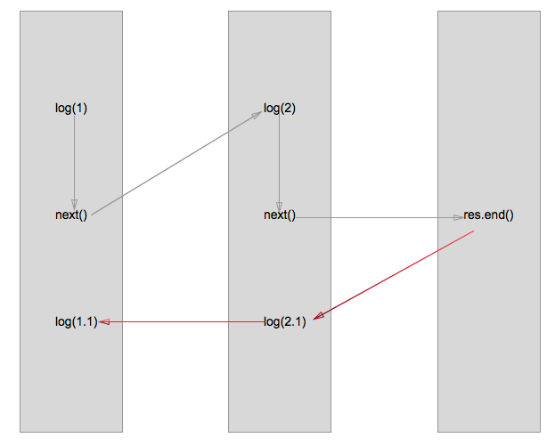

##koa学习之koa简单实现

###原型1
````
var http = require("http");

function App () {
	this.ctx = {}
	this.middlewares = [];
}

var app = App.prototype;

app.use = function(fn) {
	this.middlewares.push(fn);
}

app.response = function(){
	this.response.end("haha");
}

app.listen = function() {
	var server = http.createServer(this.cb());
	server.listen.apply(server, arguments);
}

app.cb = function() {
	var that = this;  //  函数作用域
	return function(request, response) {
		that.ctx.request = request;
		that.ctx.response = response;
		that.middlewares.forEach(function(middleware){
			middleware.call(that.ctx);
		});
		that.response.call(that.ctx);
	}
}

var appInstance = new App();
appInstance.use(function(){
	console.log(1);
})
appInstance.use(function(){
	console.log(2);
})
appInstance.listen(8080);
````

* 通过use将普通函数(注入作用域{req,res})作为中间件加入

###原型二 面向切面编程

```
app.compose = function() {
    var that = this;
    var handlelist = that.middlewares;
    var _next = function() {
        if ((handle = handlelist.shift()) != undefined) {
            handle.call(that.ctx, _next);
        }
    }
    return function() {
        _next();// 启动函数
    }
}
app.cb = function() {
    var that = this; //  函数作用域
    that.middlewares.push(that.response);
    var fn = this.compose(); 
    return function(request, response) {
        that.ctx.request = request;
        that.ctx.response = response;
        fn.call(that.ctx);
    }
}
var appInstance = new App();
appInstance.use(function(next) {
    console.log(1);
    next();
    console.log(1.1)
})
appInstance.use(function(next) {
    console.log(2);
    next();
    console.log(2.1)
})
```

核心

* 用next控制middlewares数组的遍历执行,所以最后结构是1 ， 2， end, 2.1, 1.1
* js的单线程
* 大致执行流程如下



###引入generator和co进行改进